# 🚀 Highly Available 3-Tier Web Application on AWS

> A production-style, highly available 3-tier web application deployed on **Amazon Web Services (AWS)** using multiple AWS services for scalability, security, availability, monitoring, and content delivery.

---

## 📌 Project Overview

This project demonstrates the deployment of a **Highly Available 3-Tier Web Application on AWS** following a standard cloud architecture.

The application is designed using three logical tiers:

* 🌐 **Web Tier** – Route 53, CloudFront and Application Load Balancer
* ⚙️ **Application Tier** – EC2 instances managed by Auto Scaling
* 🗄️ **Database Tier** – Amazon RDS MySQL deployed in private subnets

Additional AWS services are used for security, secrets management, monitoring, notifications, storage, and SSL/TLS.

### 🎯 Project Objectives

* Build a highly available AWS architecture
* Deploy application servers across multiple Availability Zones
* Implement load balancing using Application Load Balancer
* Configure EC2 Auto Scaling based on CPU utilization
* Keep the database in private subnets
* Secure application access using Security Groups
* Store sensitive credentials using AWS Secrets Manager
* Configure HTTPS using AWS Certificate Manager
* Use CloudFront for content delivery
* Configure a custom domain using Route 53
* Monitor infrastructure using CloudWatch
* Configure SNS notifications for monitoring alerts

---

# 🏗️ Architecture

The application follows a **3-Tier AWS Architecture** designed for availability, scalability, and security.

### 🔄 Request Flow

```text
                         👤 USER
                            │
                            ▼
                     🌐 Route 53
                            │
                            ▼
                     ☁️ CloudFront
                            │
                            ▼
                🔐 HTTPS / ACM Certificate
                            │
                            ▼
              ⚖️ Application Load Balancer
                            │
                ┌───────────┴───────────┐
                ▼                       ▼
           EC2 Instance            EC2 Instance
           AZ - ap-south-1a       AZ - ap-south-1b
                │                       │
                └───────────┬───────────┘
                            │
                     ⚙️ Application Tier
                            │
                            ▼
                    🔒 Private Subnet
                            │
                            ▼
                    🗄️ Amazon RDS
                       MySQL Database
```

### 🖼️ Architecture Diagram

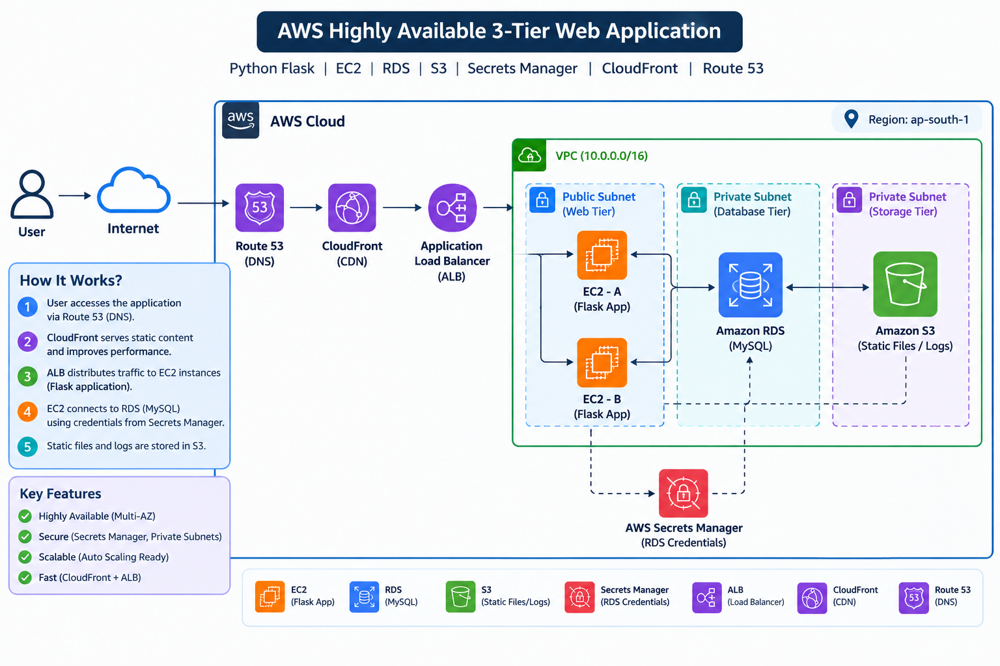

---

# ☁️ AWS Services Used

| AWS Service                  | Purpose                                  |
| ---------------------------- | ---------------------------------------- |
| 🌐 Amazon VPC                | Creates isolated AWS network             |
| 🔲 Subnets                   | Separates public and private resources   |
| 🛣️ Route Tables             | Controls network traffic routing         |
| 🔐 Security Groups           | Controls inbound and outbound traffic    |
| 💻 Amazon EC2                | Hosts the application                    |
| ⚖️ Application Load Balancer | Distributes traffic across EC2 instances |
| 📈 Auto Scaling              | Automatically adjusts EC2 capacity       |
| 🗄️ Amazon RDS               | Hosts MySQL database                     |
| 🪣 Amazon S3                 | Object storage                           |
| ☁️ CloudFront                | Content delivery and caching             |
| 🌍 Route 53                  | DNS and custom domain management         |
| 🔒 ACM                       | SSL/TLS certificate management           |
| 🔑 Secrets Manager           | Securely stores application secrets      |
| 📊 CloudWatch                | Monitoring and metrics                   |
| 🔔 SNS                       | Sends monitoring notifications           |
| 👤 IAM                       | Identity and access management           |
| 🔧 SSM                       | Secure instance management               |

---

# 🏛️ Three-Tier Architecture

## 🌐 1. Web Tier

The Web Tier handles incoming user requests.

### Components

* Amazon Route 53
* Amazon CloudFront
* Application Load Balancer
* AWS Certificate Manager

### Responsibilities

* DNS resolution
* HTTPS termination
* Content delivery
* Request distribution
* High availability

---

## ⚙️ 2. Application Tier

The Application Tier runs the web application.

### Components

* Amazon EC2
* EC2 Auto Scaling
* Application Load Balancer
* Security Groups

EC2 instances are deployed across multiple Availability Zones to improve application availability.

### Responsibilities

* Run the web application
* Process client requests
* Communicate with the database
* Scale based on workload

---

## 🗄️ 3. Database Tier

The Database Tier stores application data.

### Component

* Amazon RDS for MySQL

The database is configured inside **private subnets** and is not directly exposed to the internet.

### Responsibilities

* Store application data
* Provide database connectivity
* Maintain database availability
* Restrict direct public access

---

# 🌐 Network Architecture

The project uses an Amazon VPC with separate subnet layers.

```text
                    Amazon VPC
                 10.0.0.0/16
                       │
        ┌──────────────┼──────────────┐
        │              │              │
        ▼              ▼              ▼
   Public Subnets   App Subnets   DB Subnets
        │              │              │
        ▼              ▼              ▼
       ALB          EC2 / ASG       RDS
```

### Network Design

* VPC with private IP addressing
* Multiple Availability Zones
* Public subnet for internet-facing resources
* Private application subnet for EC2
* Private database subnet for RDS
* Route tables for traffic control
* Security Groups for resource-level access control

---

# 🔐 Security Architecture

Security is implemented using multiple AWS security mechanisms.

### Security Controls

* 🔐 Security Groups
* 👤 IAM Roles
* 🔑 AWS Secrets Manager
* 🔒 HTTPS using ACM
* 🗄️ Private RDS subnet
* 🚫 No direct public access to database
* 🔒 Least-privilege IAM permissions
* 🔧 AWS Systems Manager for secure instance administration

### Example Traffic Rules

```text
Internet
   │
   ▼
ALB : 443
   │
   ▼
EC2 : Application Port
   │
   ▼
RDS : 3306
```

Only the required traffic path is allowed between the tiers.

---

# 📈 Auto Scaling

Amazon EC2 Auto Scaling is used to maintain application availability and automatically adjust capacity.

### Scaling Configuration

```text
Normal Traffic
     │
     ▼
EC2 Instances
     │
     │ CPU increases
     ▼
Auto Scaling Policy
     │
     ▼
Launch Additional EC2
```

### Scaling Target

The application uses a target CPU utilization of approximately:

**60% CPU Utilization**

This allows the application tier to scale according to workload.

---

# ⚖️ Application Load Balancer

The Application Load Balancer distributes incoming application traffic across healthy EC2 instances.

### Benefits

* High availability
* Traffic distribution
* Health checks
* Automatic removal of unhealthy instances
* Integration with Auto Scaling

### Traffic Flow

```text
User
  │
  ▼
Application Load Balancer
  │
  ├──► EC2 Instance 1
  │
  └──► EC2 Instance 2
```

---

# 🗄️ Amazon RDS

Amazon RDS for MySQL is used as the database layer.

### Configuration

* Engine: MySQL
* Database: `appdb`
* DB Identifier: `three-tier-db`
* Deployment: Private subnet
* Public Access: Disabled
* Port: `3306`

### Security

The RDS Security Group allows database access only from the authorized application tier.

```text
EC2 Security Group
        │
        │ TCP 3306
        ▼
RDS Security Group
        │
        ▼
   MySQL Database
```

---

# 🔑 AWS Secrets Manager

AWS Secrets Manager is used to securely manage sensitive application credentials.

Sensitive information such as:

* Database username
* Database password
* Database connection information

should not be hard-coded inside application source code.

### Security Principle

```text
Application
     │
     ▼
Secrets Manager
     │
     ▼
Database Credentials
     │
     ▼
     RDS
```

---

# 🌍 Route 53

Amazon Route 53 provides DNS management for the application.

### Domain

```text
sakthisuri.online
```

Route 53 directs domain traffic toward the application's content delivery/load-balancing layer.

---

# ☁️ Amazon CloudFront

CloudFront is used as the content delivery layer.

### Benefits

* Faster content delivery
* Edge caching
* Reduced latency
* HTTPS support
* Integration with AWS infrastructure

### Request Flow

```text
User
  │
  ▼
Route 53
  │
  ▼
CloudFront
  │
  ▼
Application Load Balancer
```

---

# 🔒 AWS Certificate Manager

AWS Certificate Manager provides SSL/TLS certificates for HTTPS.

### Purpose

* Encrypt application traffic
* Enable HTTPS
* Protect data in transit
* Provide secure communication between clients and the application

```text
https://sakthisuri.online
```

---

# 🪣 Amazon S3

Amazon S3 is used for object storage.

Possible use cases include:

* Static files
* Application assets
* Project files
* Backup objects
* Logs or supporting data

S3 provides highly durable object storage.

---

# 📊 Monitoring with CloudWatch

Amazon CloudWatch is used to monitor AWS resources.

### Metrics

* EC2 CPU utilization
* ALB health
* Request metrics
* Auto Scaling activity
* RDS metrics
* Application monitoring

### Monitoring Flow

```text
AWS Resources
      │
      ▼
 CloudWatch
      │
      ├──► Metrics
      │
      ├──► Alarms
      │
      └──► Notifications
               │
               ▼
              SNS
```

---

# 🔔 Amazon SNS

Amazon SNS is used for notifications.

CloudWatch alarms can send notifications through SNS when configured monitoring conditions are triggered.

Example:

```text
CloudWatch Alarm
       │
       ▼
      SNS
       │
       ▼
Notification
```

---

# 👤 IAM

AWS Identity and Access Management is used to control access to AWS resources.

### IAM Components

* IAM Users
* IAM Roles
* IAM Policies
* Instance Roles

IAM follows the principle of:

> **Least Privilege**

Only the permissions required for a particular task should be granted.

---

# 📁 Project Structure

```text
highly-available-3-tier-aws/
│
├── 📁 app/
│   ├── 📁 static/
│   │   └── style.css
│   │
│   ├── 📁 templates/
│   │   └── index.html
│   │
│   ├── app.py
│   └── requirements.txt
│
├── 📁 architecture/
│   ├── architecture-diagram.drawio
│   └── architecture-diagram.png
│
├── 📁 docs/
│   ├── architecture.md
│   ├── deployment.md
│   ├── security.md
│   └── troubleshooting.md
│
├── 📁 screenshots/
│   ├── 01-vpc.png
│   ├── 02-subnets.png
│   ├── 03-route-tables.png
│   ├── 04-security-groups.png
│   ├── 05-ec2.png
│   ├── 06-alb.png
│   ├── 07-target-groups.png
│   ├── 08-auto-scaling.png
│   ├── 09-rds.png
│   ├── 10-s3.png
│   ├── 11-cloudfront.png
│   ├── 12-route53.png
│   ├── 13-acm.png
│   ├── 14-secrets-manager.png
│   ├── 15-cloudwatch.png
│   ├── 16-sns.png
│   ├── 17-iam.png
│   └── 18-final-Application.png
│
├── 📁 scripts/
│   ├── deployment-notes.md
│   └── user-data.sh
│
├── .gitignore
├── LICENSE
└── README.md
```
# 📸 AWS INFRASTRUCTURE EVIDENCE

The `screenshots/` directory contains evidence of the AWS resources configured during the project.

---

<h2>🌐 01 — VPC CONFIGURATION</h2>

<b>VPC configuration and CIDR setup</b>

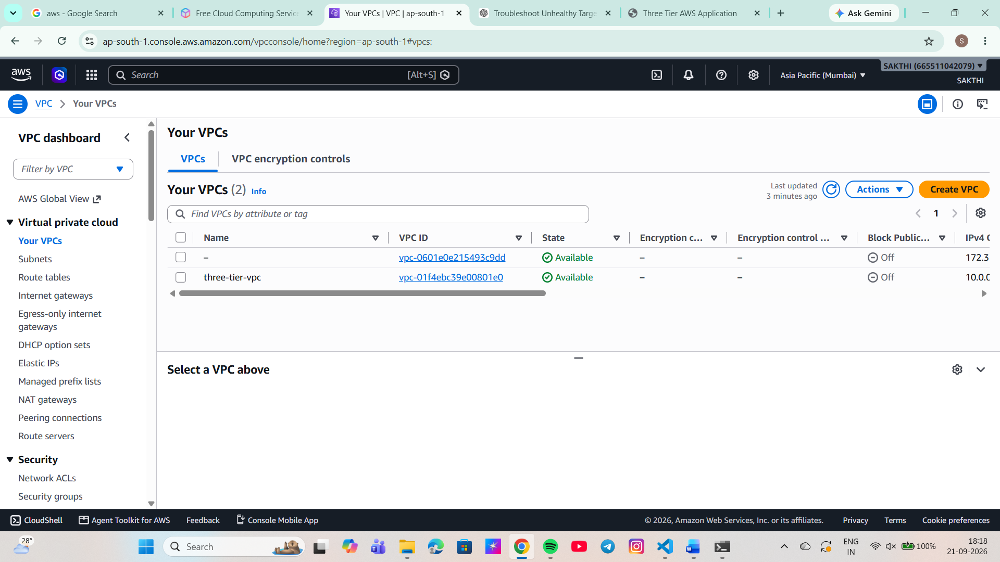

---

<h2>🧩 02 — SUBNET CONFIGURATION</h2>

<b>Public, private application and database subnets</b>

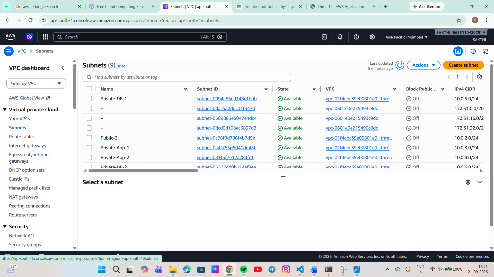

---

<h2>🛣️ 03 — ROUTE TABLE CONFIGURATION</h2>

<b>Public and private route table configuration</b>

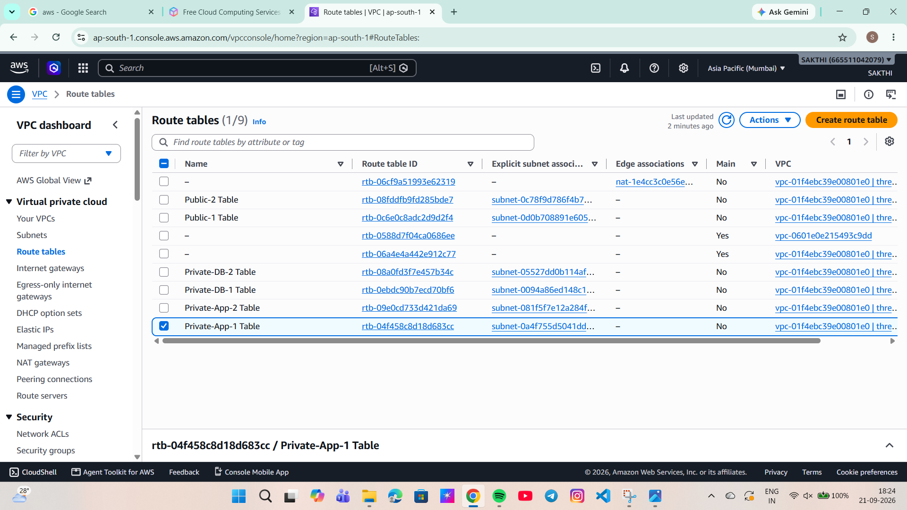

---

<h2>🛡️ 04 — SECURITY GROUPS</h2>

<b>ALB, application and database security rules</b>

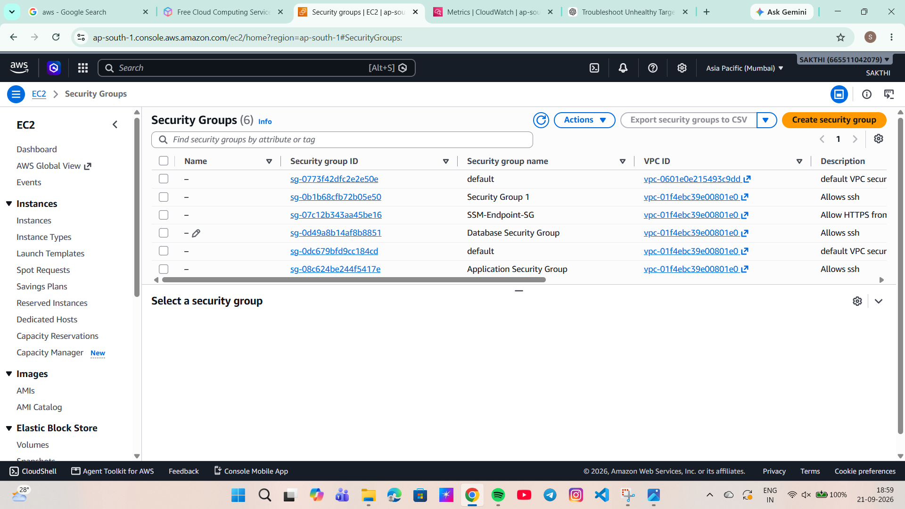

---

<h2>💻 05 — EC2 CONFIGURATION</h2>

<b>Application server EC2 configuration</b>

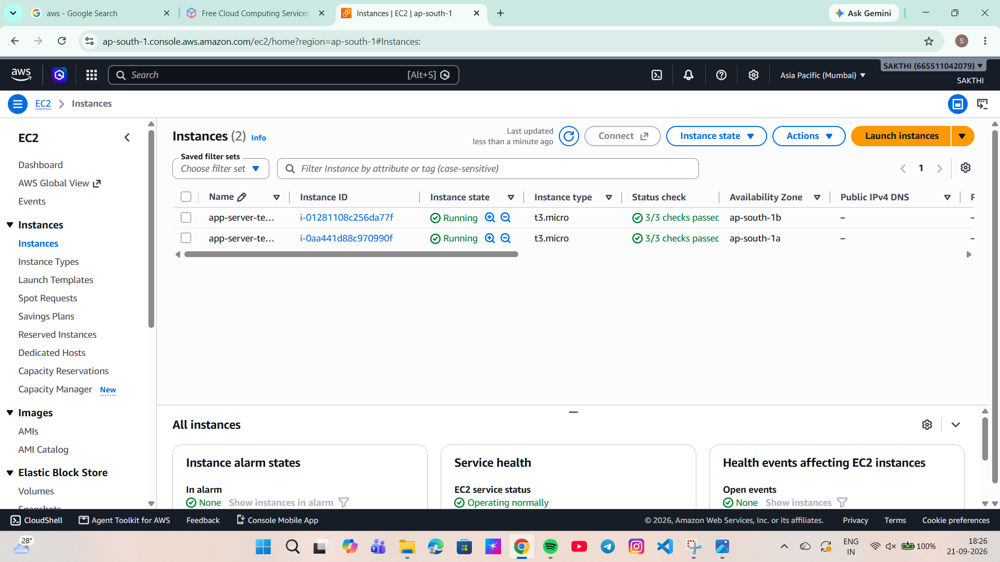

---

<h2>⚖️ 06 — APPLICATION LOAD BALANCER</h2>

<b>Internet-facing Application Load Balancer</b>

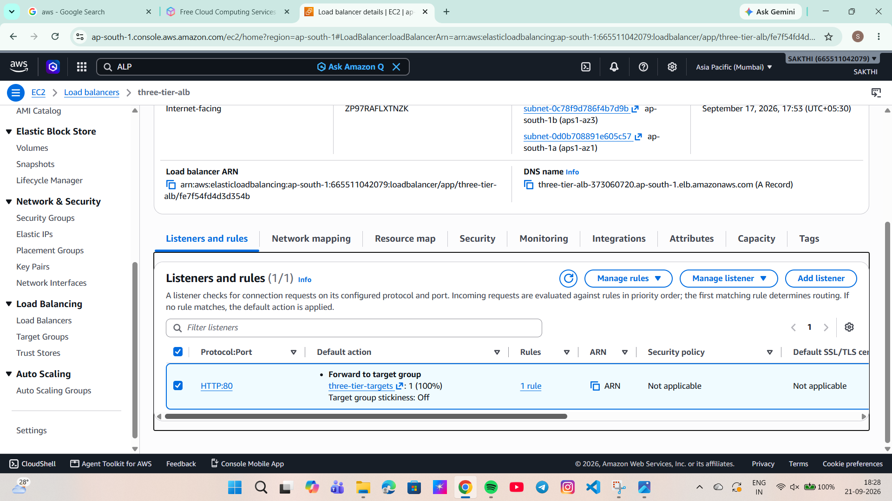

---

<h2>🎯 07 — TARGET GROUP</h2>

<b>Target group and health check configuration</b>

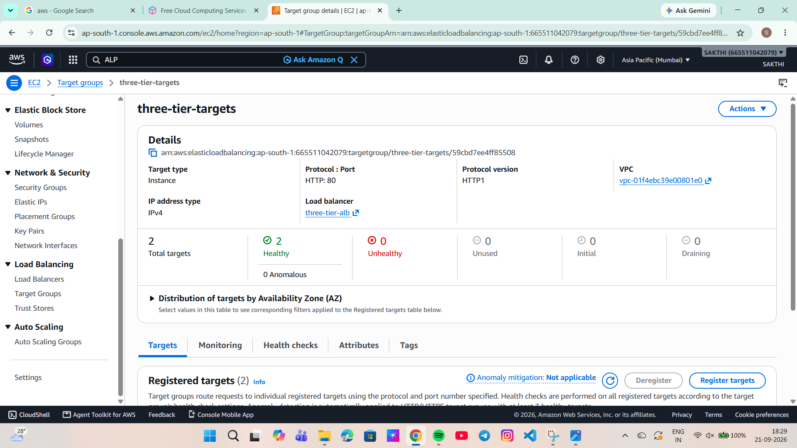

---

<h2>📈 08 — AUTO SCALING</h2>

<b>Auto Scaling Group configuration</b>

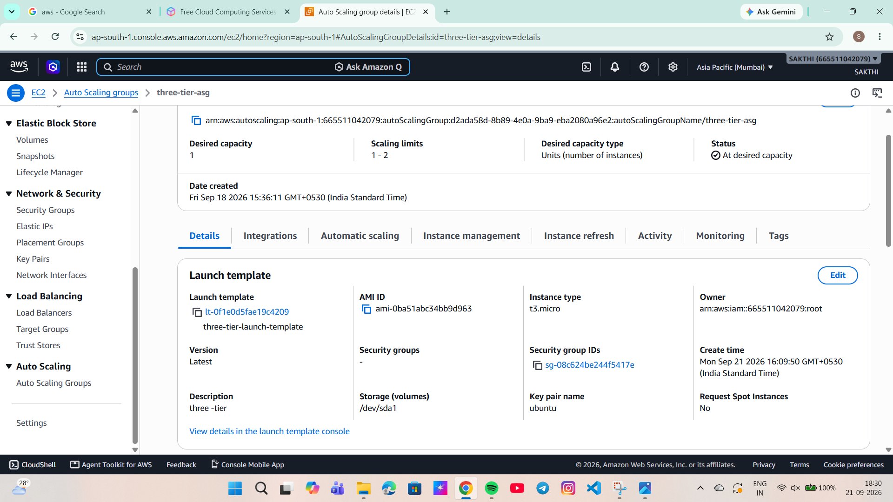

---

<h2>🗄️ 09 — RDS MYSQL DATABASE</h2>

<b>Private RDS MySQL database configuration</b>

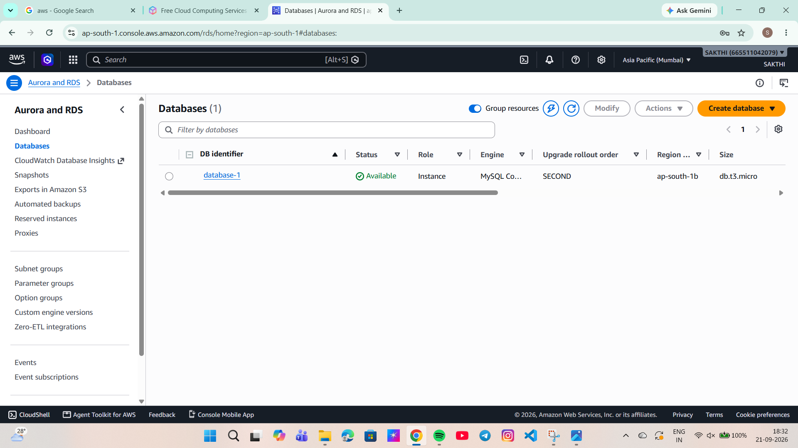

---

<h2>🪣 10 — AMAZON S3</h2>

<b>Private S3 bucket configuration</b>

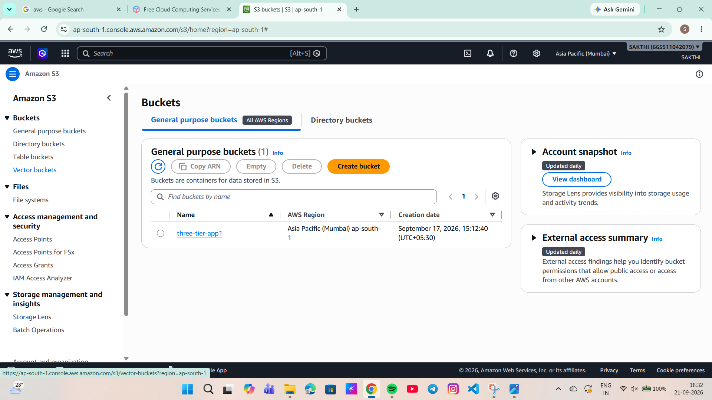

---

<h2>🌍 11 — CLOUDFRONT</h2>

<b>CloudFront distribution configuration</b>

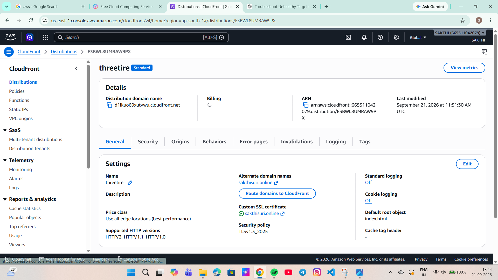

---

<h2>🌐 12 — ROUTE 53 DNS</h2>

<b>Custom domain and DNS configuration</b>

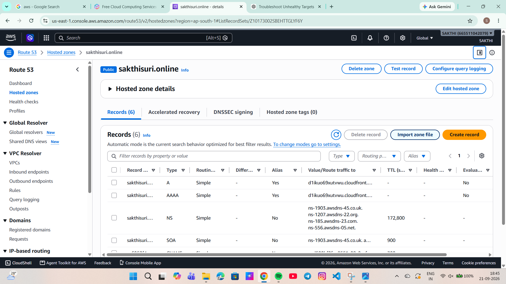

---

<h2>🔐 13 — AWS CERTIFICATE MANAGER</h2>

<b>SSL/TLS certificate configuration</b>

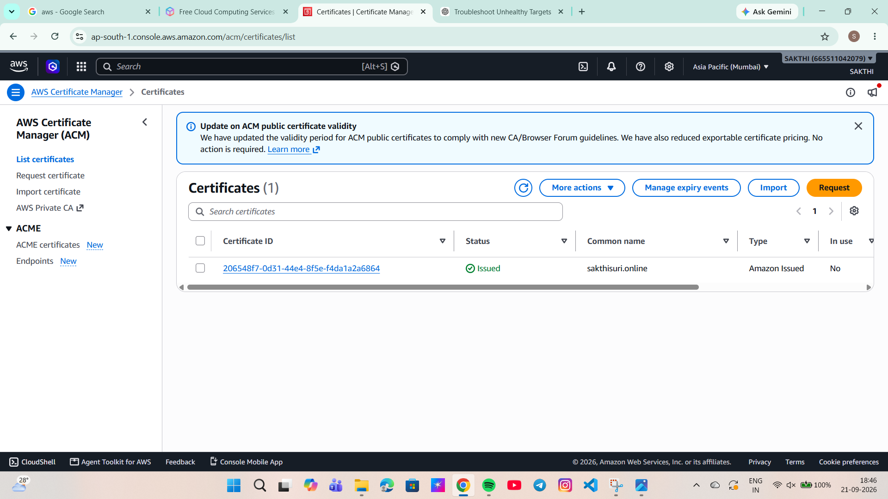

---

<h2>🔑 14 — SECRETS MANAGER</h2>

<b>Secure database credentials management</b>

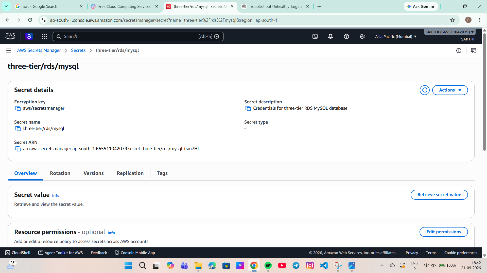

---

<h2>📊 15 — CLOUDWATCH MONITORING</h2>

<b>Application monitoring and metrics</b>

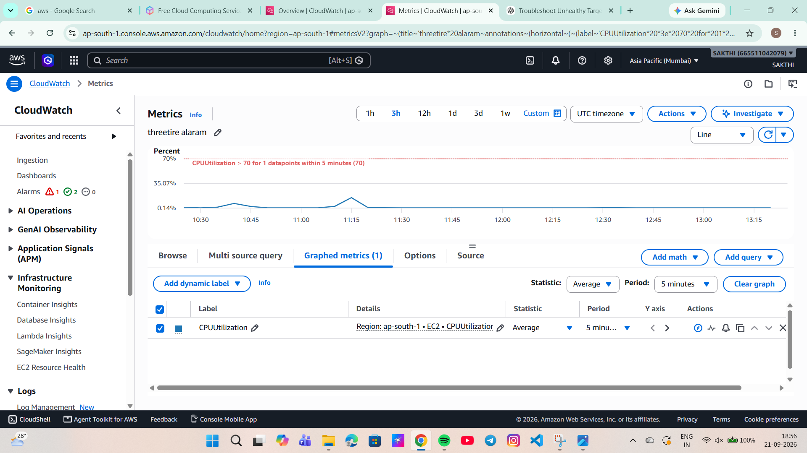

---

<h2>📢 16 — SNS NOTIFICATIONS</h2>

<b>SNS topic and notification configuration</b>

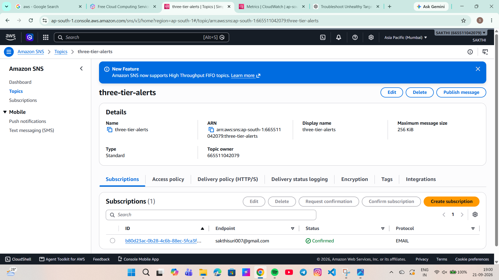

---

<h2>🛡️ 17 — IAM CONFIGURATION</h2>

<b>IAM roles and policies</b>

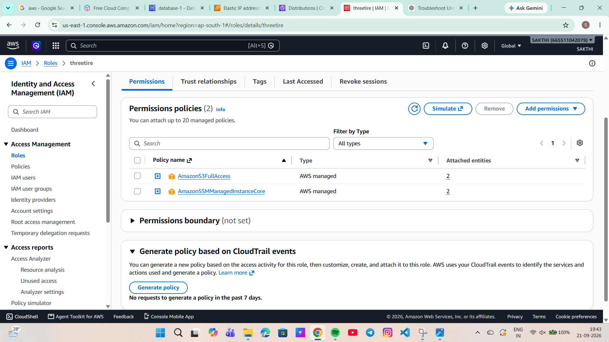

---

<h1 align="center">☁️ AWS DEPLOYMENT</h1>

<h2 align="center">🚀 FINAL APPLICATION</h2>

<p align="center">
  <b>Highly Available 3-Tier Web Application</b>
</p>

<p align="center">
  ─────────────────────────────────────
</p>

<p align="center">
  
</p>

<br>

<p align="center">
  <b>🔐 HTTPS</b>
  &nbsp;&nbsp; ➜ &nbsp;&nbsp;
  <b>⚖️ ALB</b>
  &nbsp;&nbsp; ➜ &nbsp;&nbsp;
  <b>💻 EC2</b>
  &nbsp;&nbsp; ➜ &nbsp;&nbsp;
  <b>🗄️ RDS</b>
</p>

<p align="center">
  <b>☁️ AWS CLOUD INFRASTRUCTURE</b>
</p>

<br>

<p align="center">
  <b>✨ DEPLOYMENT SUCCESSFUL ✨</b>
</p>

<p align="center">
  <i>Secure • Scalable • Highly Available</i>
</p>

---

# 🧩 Infrastructure Documentation

Detailed configuration for each AWS component is documented separately.

### 🌐 Networking

* [VPC Documentation](infrastructure/vpc/README.md)
* [Security Groups](infrastructure/security-groups/README.md)

### 💻 Compute & Load Balancing

* [EC2 Documentation](infrastructure/ec2/README.md)
* [Application Load Balancer](infrastructure/alb/README.md)
* [Auto Scaling](infrastructure/autoscaling/README.md)

### 🗄️ Storage & Database

* [RDS Documentation](infrastructure/rds/README.md)
* [S3 Documentation](infrastructure/s3/README.md)

### ☁️ Content Delivery & DNS

* [CloudFront Documentation](infrastructure/cloudfront/README.md)
* [Route 53 Documentation](infrastructure/route53/README.md)
* [ACM Documentation](infrastructure/acm/README.md)

### 🔐 Security

* [Secrets Manager](infrastructure/secrets-manager/README.md)
* [IAM Documentation](infrastructure/iam/README.md)

### 📊 Monitoring

* [CloudWatch Documentation](infrastructure/cloudwatch/README.md)
* [SNS Documentation](infrastructure/sns/README.md)

---

# 🔄 End-to-End Application Flow

The complete request flow is:

```text
                        👤 Client
                           │
                           ▼
                     🌍 Route 53
                           │
                           ▼
                     ☁️ CloudFront
                           │
                           ▼
                    🔒 HTTPS / ACM
                           │
                           ▼
                ⚖️ Application Load Balancer
                           │
                    ┌──────┴──────┐
                    ▼             ▼
                 EC2-A          EC2-B
                    │             │
                    └──────┬──────┘
                           │
                           ▼
                    🗄️ Private RDS
                       MySQL
```

---

# 🔐 Security Flow

```text
Internet
   │
   │ HTTPS : 443
   ▼
CloudFront / ALB
   │
   │ Application Port
   ▼
EC2 Application Tier
   │
   │ MySQL : 3306
   ▼
Private RDS
```

The database tier is isolated from direct internet access.

---

# 📊 High Availability

The architecture is designed to avoid depending on a single application server.

```text
              Application Load Balancer
                         │
              ┌──────────┴──────────┐
              ▼                     ▼
         Availability Zone A   Availability Zone B
              │                     │
              ▼                     ▼
          EC2 Instance          EC2 Instance
              │                     │
              └──────────┬──────────┘
                         ▼
                       RDS
```

Using multiple Availability Zones helps improve application availability and allows traffic to be distributed between healthy application instances.

---

# 🛠️ Technologies Used

### ☁️ Cloud

* Amazon Web Services
* Amazon VPC
* Amazon EC2
* Amazon RDS
* Amazon S3
* Amazon CloudFront
* Amazon Route 53
* AWS Certificate Manager
* AWS Secrets Manager
* Amazon CloudWatch
* Amazon SNS
* AWS IAM
* AWS Systems Manager

### 💻 Application

* HTML5
* CSS3
* Python / Flask
* MySQL

### 🔧 Tools

* Git
* GitHub
* Visual Studio Code
* AWS Management Console
* AWS CLI

---

# 🧪 Testing

The following areas were tested during deployment:

### Application Testing

* Application accessibility
* HTTP/HTTPS connectivity
* Domain resolution
* Load Balancer connectivity

### Infrastructure Testing

* EC2 instance health
* Target Group health checks
* Auto Scaling behaviour
* RDS connectivity
* Security Group rules

### Security Testing

* HTTPS certificate
* Private database access
* Security Group restrictions
* IAM permissions
* Secrets Manager configuration

### Monitoring Testing

* CloudWatch metrics
* CloudWatch alarms
* SNS notifications

---

# 🐛 Troubleshooting

Common issues encountered during deployment can be documented in:

**`docs/`**

Recommended troubleshooting topics:

```text
ALB Target Unhealthy
        │
        ├── Check Security Group
        ├── Check Application Port
        ├── Check Target Group
        └── Check Application Service
```

```text
EC2 Cannot Connect to RDS
        │
        ├── Check RDS Security Group
        ├── Check EC2 Security Group
        ├── Check Port 3306
        ├── Check Route Tables
        └── Check RDS Endpoint
```

---

# 📚 Documentation

Additional project documentation can be maintained inside the `docs/` directory.

Suggested documentation:

```text
docs/
├── deployment.md
├── security.md
└── troubleshooting.md
```

---

# 🚀 Deployment Summary

The project was implemented using the following high-level sequence:

```text
1. Create VPC
       ↓
2. Create Subnets
       ↓
3. Configure Route Tables
       ↓
4. Configure Security Groups
       ↓
5. Deploy EC2 Instances
       ↓
6. Configure Application
       ↓
7. Create Target Group
       ↓
8. Create Application Load Balancer
       ↓
9. Configure Auto Scaling
       ↓
10. Create RDS MySQL
       ↓
11. Configure S3
       ↓
12. Configure Secrets Manager
       ↓
13. Configure ACM
       ↓
14. Configure CloudFront
       ↓
15. Configure Route 53
       ↓
16. Configure CloudWatch
       ↓
17. Configure SNS
       ↓
18. Validate Application
```

---

# 🔒 GitHub Security

Sensitive information must **never** be committed to GitHub.

Do not upload:

```text
❌ AWS Access Keys
❌ AWS Secret Keys
❌ .pem files
❌ .key files
❌ Database passwords
❌ Secrets Manager secret values
❌ .env files
❌ Private credentials
```

The `.gitignore` file is used to prevent sensitive files from being committed.

---

# 📈 Future Improvements

Possible future enhancements include:

* Infrastructure as Code using Terraform
* CI/CD using GitHub Actions
* Containerization using Docker
* Amazon ECS / Amazon EKS deployment
* HTTPS-only redirect
* WAF integration
* Centralized logging
* Automated database backups
* Multi-region disaster recovery
* Blue/Green deployment
* Automated security scanning

---

# 🎓 Skills Demonstrated

This project demonstrates practical knowledge of:

* AWS Cloud Architecture
* VPC Networking
* Public and Private Subnets
* Route Tables
* Security Groups
* EC2
* Application Load Balancer
* Target Groups
* Auto Scaling
* Amazon RDS MySQL
* Amazon S3
* CloudFront
* Route 53
* ACM
* Secrets Manager
* IAM
* CloudWatch
* SNS
* AWS Systems Manager
* High Availability
* Application Security
* Monitoring and Alerting
* Git and GitHub

---

# 👨‍💻 Author

**Sakthivel**

AWS Cloud & Networking Enthusiast

### Project

**Highly Available 3-Tier Web Application on AWS**

### Region

`ap-south-1 (Mumbai)`

### Domain

`sakthisuri.online`

---

# ⭐ Project Highlights

```text
☁️ AWS Cloud Architecture
🏗️ 3-Tier Application Design
🌐 Multi-AZ Architecture
⚖️ Application Load Balancing
📈 Auto Scaling
🗄️ Private RDS MySQL
🔐 Secure Secrets Management
🔒 HTTPS / SSL
☁️ CloudFront CDN
🌍 Route 53 DNS
📊 CloudWatch Monitoring
🔔 SNS Notifications
👤 IAM Security
📸 AWS Infrastructure Evidence
```

---

## 📌 Project Status

**Status:** ✅ Completed

**Architecture:** Highly Available 3-Tier AWS Web Application

**Environment:** AWS Cloud

**Primary Region:** `ap-south-1`

---

> **Note:** This repository is created for learning, portfolio, and demonstration purposes. AWS resources may incur charges depending on configuration and usage.
